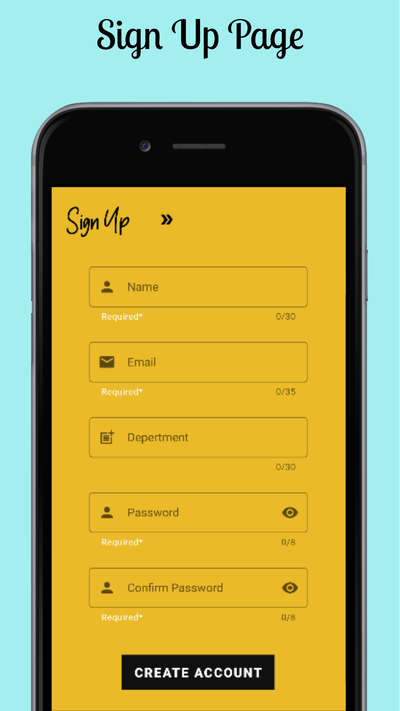
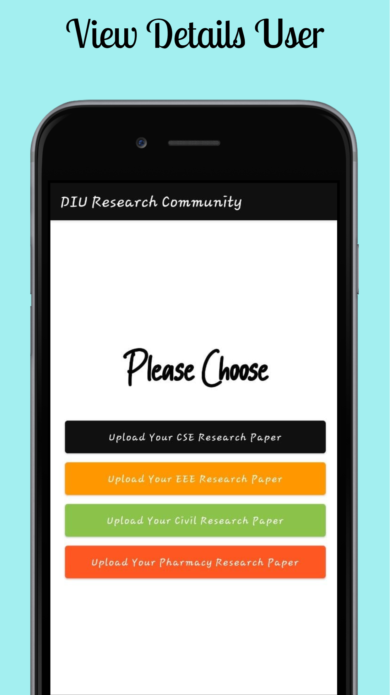
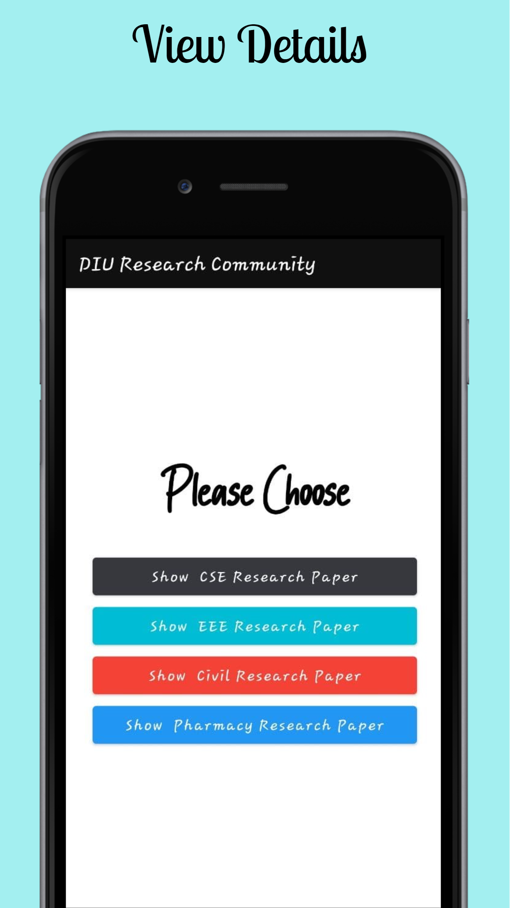
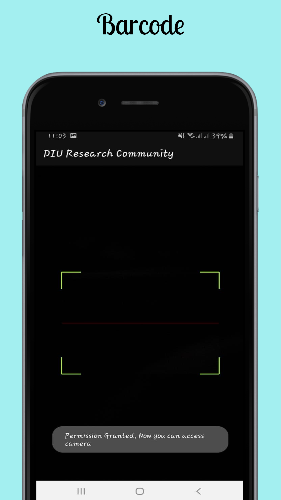

# DIU-Research-Community-App

The main feature of this software is that the research files of the university can be uploaded here. Anyone of our university can easily view the research files by registering the software. Then there are some books to read about research, then some blogs, then there is a system of notepads for writing short stories on research topics. Then the system to know when it will be in the international conference etc. Then if there is any problem or any kind of event in the software then it will be easily informed through push notification from admin panel.

# Some Screenshot This App :

                     

